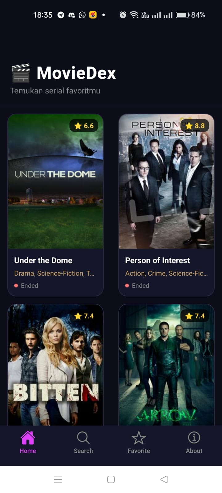
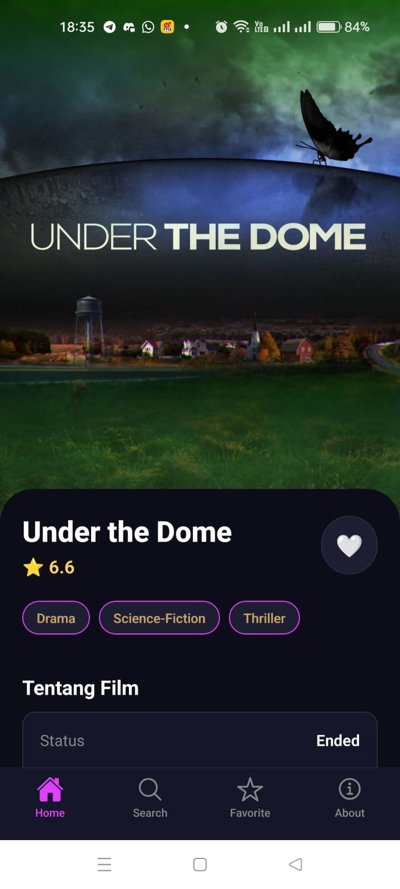
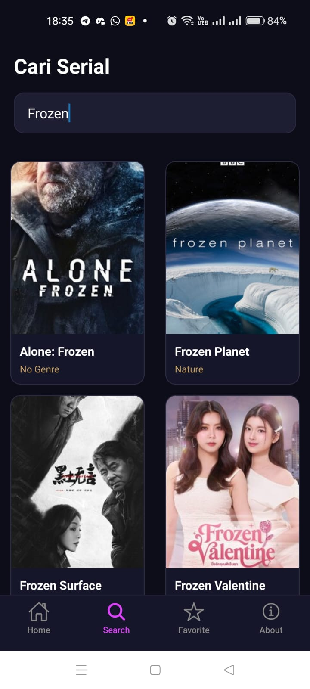
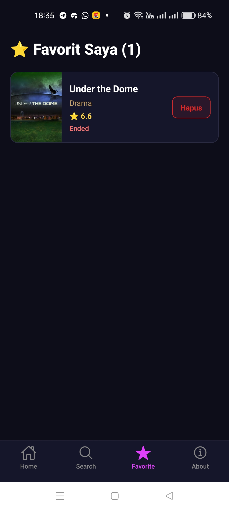
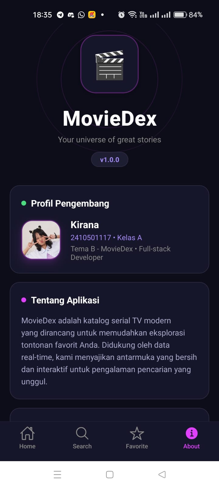

# MovieDex

**MovieDex**

- **Nama** : Kirana Fitria U.
- **NIM** : 2410501117
- **Kelas** : Pemrograman Mobile Lanjut - A
- **Tema** : MovieDex (B)

---

## Tech Stack

- **Framework**: [React Native](https://reactnative.dev/) ([Expo SDK 54](https://docs.expo.dev/))
- **Navigation**: [React Navigation 7](https://reactnavigation.org/) (Native Stack & Bottom Tabs)
- **State Management**: [Zustand](https://github.com/pmndrs/zustand) (Untuk manajemen _state_ global pada fitur Favorit)
- **HTTP Client**: [Axios] (https://axios-http.com/)Axios (Untuk fetching data dengan endpoint TVMaze)
- **UI & Styling**: React Native Gesture Handler
- [@expo/vector-icons](https://icons.expo.fyi/) (Menggunakan _icon set_ Feather yang konsisten)

---

## Cara Install dan Run

1.  **Clone Repository**

    ```bash
    git clone
    cd

    ```

2.  **Install Dependencies**
    ```bash
    npm install
    ```
3.  **Run Metro Bundler**
    ```bash
    npx expo start -c
    ```
4.  **Scan QR Code**: Buka aplikasi **Expo Go** di Android/iOS dan scan QR Code yang muncul di terminal.

---

## Screenshots







---

## Video Demo

- [Klik di sini untuk menonton Video Demo Aplikasi(gdrive)](https://drive.google.com/drive/folders/1OMi1SxONk2Rt5TQNV5npHuYm8eqxDL6f?usp=sharing)

---

## Penjelasan State

Pada proyek MovieDex ini, saya menggunakan Context API sebagai state management utama untuk mengelola daftar film favorit (FavoriteContext.js).

Justifikasi: enggunaan Context API sangat tepat karena daftar film favorit perlu diakses dan diperbarui dari berbagai halaman (komponen HomeScreen, DetailScreen, maupun FavoriteScreen). Dengan Context API, kita tidak perlu mengirimkan props secara manual dari satu layar ke layar lainnya (props drilling), sehingga kode menjadi lebih bersih, modular, dan mudah dirawat.

---

## Referensi

1. React Navigation Docs: https://reactnavigation.org/docs/getting-started - Untuk struktur navigasi Stack dan Bottom Tabs.

2. TVMaze API Documentation: https://www.tvmaze.com/api - Referensi endpoint pencarian film dan cast.

3. Zustand Documentation: https://docs.pmnd.rs/zustand/getting-started/introduction - Panduan state management.

4. Axios Configuration: https://axios-http.com/docs/req_config - Konfigurasi dan error handling untuk API.

---

## Refleksi

Proyek MovieDex ini merupakan implementasi dari berbagai materi penting yang telah dipelajari dalam mata kuliah Pemrograman Mobile Lanjut. Pengembangan aplikasi ini memberikan pemahaman mendalam tentang bagaimana mengintegrasikan layanan data dari pihak ketiga, yaitu TVMaze API, ke dalam sebuah aplikasi mobile menggunakan Axios. Salah satu tantangan teknis yang berhasil diselesaikan adalah penerapan Nested Navigation menggunakan React Navigation. Hal ini memastikan agar navigasi seperti halaman detail dapat diakses tanpa kehilangan menu tab utama yang menjaga pengalaman pengguna (user experience) tetap konsisten.

Selain itu, implementasi state management menggunakan Context API membuktikan pentingnya manajemen data global dalam aplikasi. Pengguna dapat mengelola daftar film favorit secara efisien dan personal. Penggunaan Dark Mode juga dirancang untuk memberikan kenyamanan visual saat menggunakan aplikasi.

Secara keseluruhan, proyek ini tidak hanya mengajarkan aspek teknis coding, tetapi juga bagaimana menyusun alur kerja pengembangan perangkat lunak yang terstruktur. Dokumentasi ini menjadi catatan penting mengenai proses pembelajaran yang dialami selama mengerjakan proyek MovieDex.
